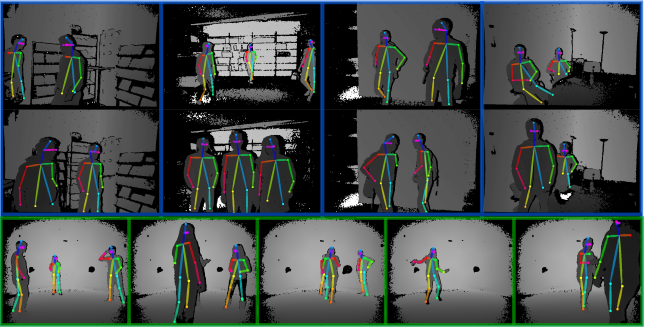

# Efficient Pose Machines for Multi-Person Pose Estimation





Code and CNN models of the paper [Efficient Convolutional Neural Networks for Depth-Based Multi-Person Pose Estimation](https://arxiv.org/abs/1912.00711) to perform efficient human pose estimation in depth images. SquezeeNet Pose Machines (SPM), MobileNet Pose Machines (MPM) and Residual Pose Machines models (RPM) are included.


## Usage


You will need **Pytorch** >= 1.3 and OpenCV. 
The following performs human pose estimation using the RPM model on a sample of the [Panoptic data](http://domedb.perception.cs.cmu.edu/range_of_motion.html).

```
python3 main.py --img_path img_samples/PANOPTIC/pose3_50_02/depth_02_000000000326.mat  \
                --dataset_type panoptic \
                --model_config config_files/RPM_config.json
```

This will save confidence map and part affinity field images as well as keypoint detections in _results/panoptic_. To use a different pose machine choose another configuration file from _config_files/_. 

For more args please run

```
python3 main.py --help
```

## Different Pose Machines

All the models presented in the TSCVT paper are included and can be selected using a different parameter configuration

* **RPM**: RPM_config.json
* **SPM**: SPM_config.json
* **MPM**: MPM_config.json
* **Distilled MPM**: MPM_distilled_config.json (faster and better than MPM).


## Citation
If you happen to use the models and code for your research please cite the following [paper](https://arxiv.org/abs/1912.00711):
```
@ARTICLE{Martinez_TCSVT_2019,
author={Angel {Martínez-González} and Michael {Villamizar} and Olivier {Canévet} and Jean-Marc {Odobez}},
journal={IEEE Transactions on Circuits and Systems for Video Technology},
title={Efficient Convolutional Neural Networks for Depth-Based Multi-Person Pose Estimation},
year={2019},
doi={10.1109/TCSVT.2019.2952779},}
```


